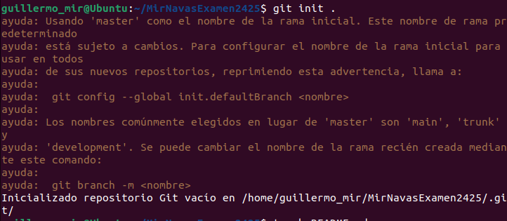

Instruccions
1. Configuració inicial
1.Comprova la versió instal·lada de Git, fes captura del terminal.

2.Configura Git al teu sistema (opcional)

3.Mostra la configuració actual per verificar-ho, fes captura del terminal. Explica com veig que he configurat correctament el email i el nom.

4.Inicia un nou repositori Git al directori de treball on consideris. El nom del directorio ha de ser Cognom1Cognom2Examen2425.

5.Crea un document README.md, afegeix el document i fes un primer commit que amb el missatge 1 - Git init

2. Creació del projecte web
1.Crea els fitxers següents al directori del projecte:
	index.html
	testunitari.html
	style.css
	main.js
	
2.Afegeix contingut bàsic a cada fitxer.

3. Gestió amb Git
1.Afegir fitxers:
Utilitza un patró d'expressió regular per afegir tots els fitxers .html i .css. Fes captura del terminal

2.Verifica l'estat del repositori, fes captura del terminal

3.Elimina testunitari.html del staging

4.Fes un commit que amb el missatge '2- Estructura bàsica'

5.Consulta l'historial de commits, fes captura del terminal.
